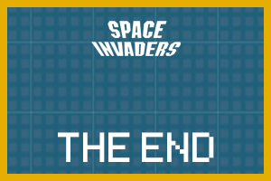

# 👾 Mini Jeu Space Invaders - Projet Personnel avec Pygame

Bienvenue dans ce petit projet **Space Invaders** développé avec ❤️ en **Python** et **Pygame** !  
L'objectif était pour moi de mieux maîtriser la bibliothèque Pygame tout en m'amusant avec un classique du jeu vidéo.

## 🎯 Objectif du projet

Ce projet a été réalisé dans un cadre personnel afin de :

- Approfondir ma pratique du **langage Python**.
- Apprendre à utiliser la **bibliothèque Pygame** pour créer un jeu 2D.
- Implémenter des concepts comme les boucles de jeu, la gestion des collisions, le système de score, les bonus et les animations.

## 📸 Aperçu du jeu




Le joueur contrôle un vaisseau spatial avec les flèches gauche/droite et tire des projectiles avec la barre espace pour éliminer les aliens.  
Le but est de **survivre** le plus longtemps possible, accumuler des **kills**, et obtenir le **meilleur score** !

## 🕹️ Commandes

| Touche       | Action                      |
|--------------|-----------------------------|
| Flèche gauche| Déplacer le vaisseau à gauche |
| Flèche droite| Déplacer le vaisseau à droite |
| Espace       | Tirer un projectile         |
| Fermer la fenêtre | Quitter le jeu          |

## ⚙️ Fonctionnalités

- 👽 Ennemis qui avancent de plus en plus vite.
- 💣 Bombes lancées aléatoirement par les aliens.
- 💙 Bonus de munitions aléatoires.
- 💔 Gestion de la vie (3 cœurs).
- 🔥 Score final affiché à la fin.
- 🎮 Fin du jeu si plus de projectiles ou si le joueur est touché.

## 📁 Fichiers

- `main.py` : code principal du jeu.
- `alien.png`, `vaisseau.png`, `bombe.png` : sprites du jeu.
- `background.png` : fond d'écran.
- `endscreen.png` : écran de fin.

## 🚀 Lancer le jeu

Assurez-vous d'avoir **Python 3** installé ainsi que le module `pygame`.

```bash
pip install pygame
```
Ensuite, lance le jeu :

python main.py
